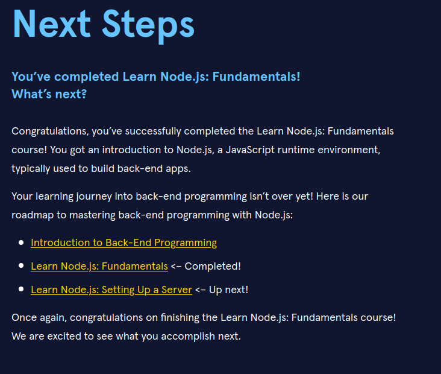

# Beginning_NodeJS

Learning some node.js

## Begin Here

[Course on Codecademy](https://www.codecademy.com/enrolled/courses/learn-nodejs-fundamentals)

## Vocabulary

> **REPL**  
> An abbreviation for **r**ead–**e**val–**p**rint **l**oop. It’s a program that loops, or repeatedly cycles, through three different states: a read state where the program reads input from a user, the eval state where the program evaluates the user’s input, and the print state where the program prints out its evaluation to a console. Then it loops through these states again.  

___

> **Event Loop** ([Read more](https://nodejs.org/en/learn/asynchronous-work/event-loop-timers-and-nexttick))  
> The event loop is what allows Node.js to perform non-blocking I/O operations — despite the fact that a single JavaScript thread is used by default — by offloading operations to the system kernel whenever possible.
>
> Since most modern kernels are multi-threaded, they can handle multiple operations executing in the background. When one of these operations completes, the kernel tells Node.js so that the appropriate callback may be added to the poll queue to eventually be executed. We'll explain this in further detail later in this topic.  

___

> **Poll Phase** ([Read more](https://nodejs.org/en/learn/asynchronous-work/event-loop-timers-and-nexttick#poll))  
> The poll phase has two main functions:
>
> 1. Calculating how long it should block and poll for I/O, then
> 2. Processing events in the **poll** queue.  
>
> When the event loop enters the poll phase and there are no timers scheduled, one of two things will happen:
> - If the poll queue is not empty, the event loop will iterate through its queue of callbacks executing them synchronously until either the queue has been exhausted, or the system-dependent hard limit is reached.
> - If the poll queue is empty, one of two more things will happen:
>   - If scripts have been scheduled by setImmediate(), the event loop will end the poll phase and continue to the check phase to execute those scheduled scripts.
>   - If scripts have not been scheduled by setImmediate(), the event loop will wait for callbacks to be added to the queue, then execute them immediately.
>
> Once the poll queue is empty the event loop will check for timers whose time thresholds have been reached. If one or more timers are ready, the event loop will wrap back to the timers phase to execute those timers' callbacks.

___

## What Now?

[Introduction to Back-End Programming](https://www.codecademy.com/learn/introduction-to-back-end-programming)  
[Setting Up a Server](https://www.codecademy.com/learn/learn-nodejs-setting-up-a-server)
